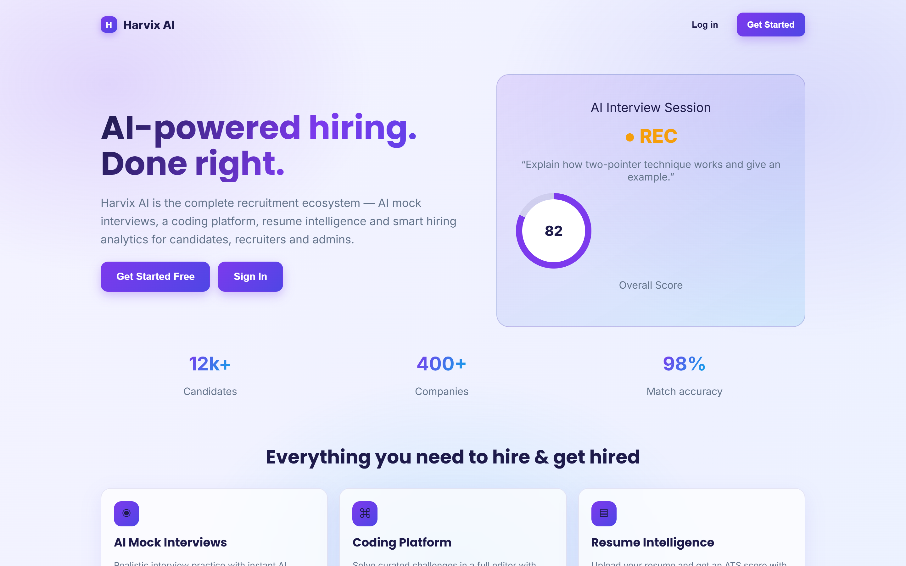
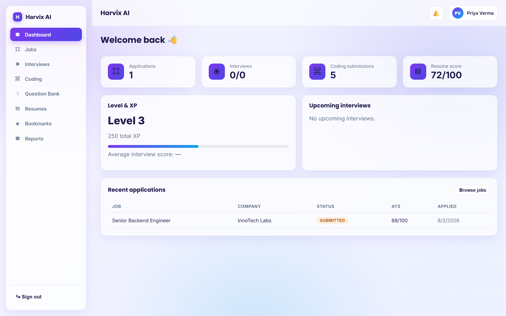
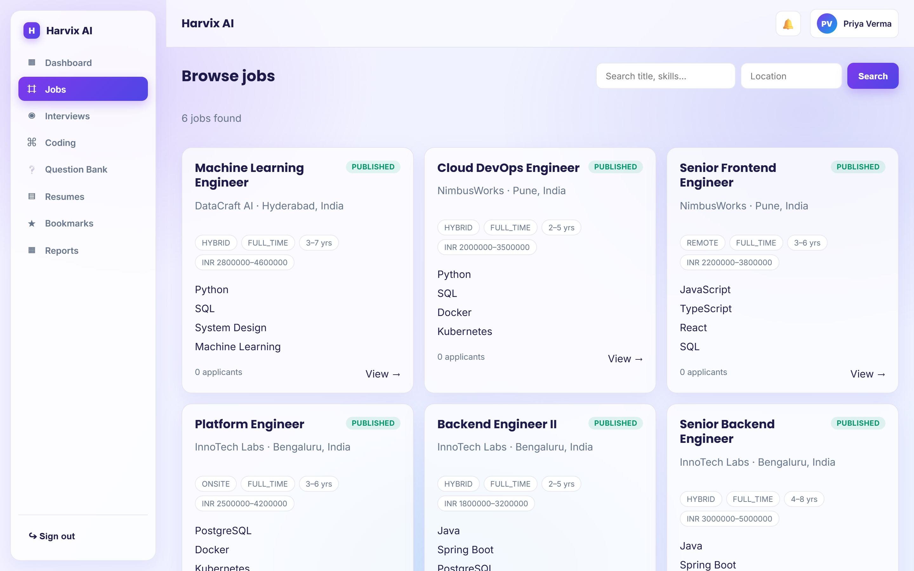
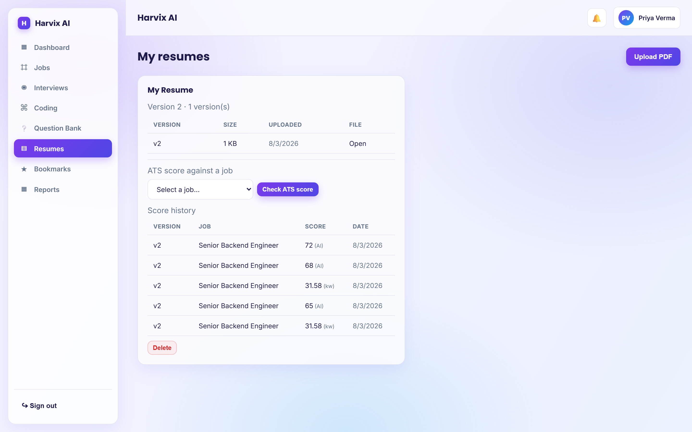
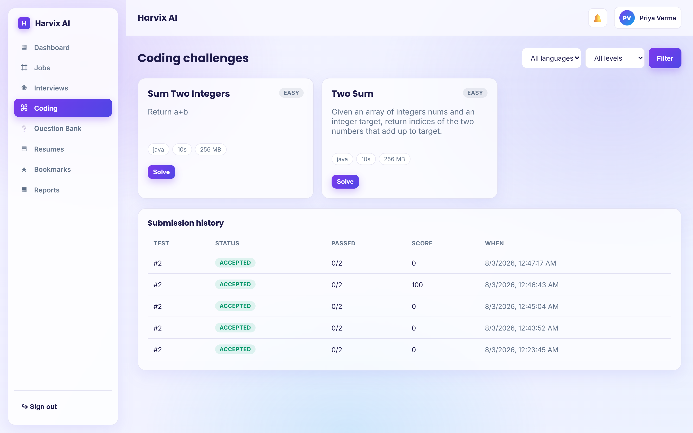
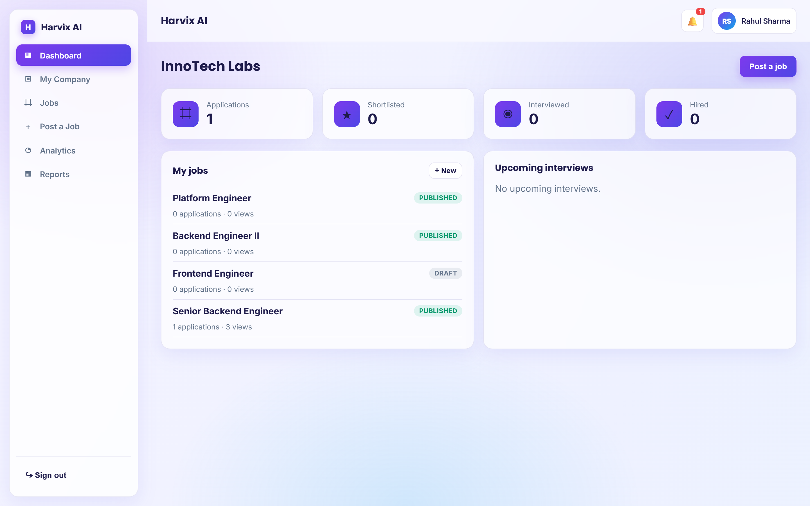
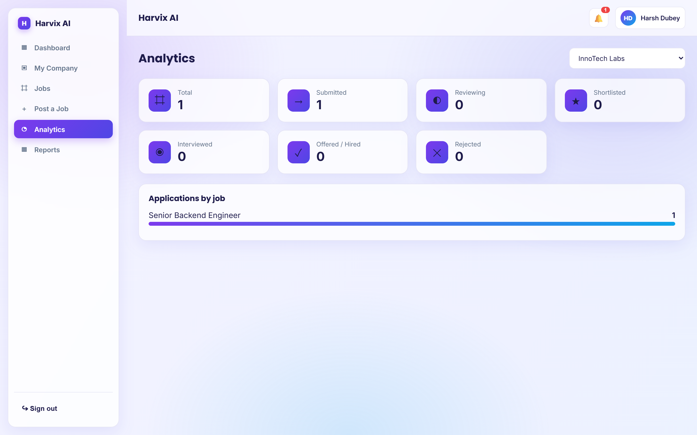

# Harvix AI — AI-Powered Recruitment Platform

[](https://github.com/Harsh1234Dubey/harvix-ai/actions/workflows/ci.yml)

> Enterprise-grade AI recruitment SaaS that runs 100% on localhost.

## Overview

Harvix AI is a full-stack recruitment platform serving three roles — **Admin**,
**Recruiter**, and **Candidate** — powered by the **Google Gemini API** for resume
analysis, ATS scoring, mock interviews, code review, and recruiter assistance.

Everything runs locally:

| Component  | URL                    |
|------------|------------------------|
| Frontend   | http://localhost:5173  |
| Backend    | http://localhost:8080  |
| Database   | localhost:5432         |

> Note: the backend artifact/package still use the internal name `interview-ai`
> (`com.interviewai`); the public product is **Harvix AI**.

---

## Tech Stack

### Frontend
React 19 · TypeScript · Vite 6 · React Router · Axios · Custom CSS components (`components/ui`)

### Backend
Java 21 · Spring Boot 3.5 · Spring Security (JWT) · Spring Data JPA / Hibernate · Lombok · ModelMapper · Swagger/OpenAPI (springdoc) · Bean Validation · PDFBox (resume text extraction)

### Database / AI / Storage
PostgreSQL 17 (local) · Google Gemini API (`gemini-flash-latest`) · Local file storage

### Testing
JUnit 5 · Mockito · Vite `tsc` + build

---

## Feature Highlights

- **Auth:** Register, login, JWT access/refresh tokens, remember-me, forgot/reset password, simulated email verification, RBAC
- **Candidate:** Dashboard, profile, resume upload (PDF only) with version history, **ATS resume score + score history**, apply/save jobs, application tracking, AI mock interviews, coding assessments (in-browser editor), question bank, reports
- **Recruiter:** Dashboard, company management, job posting, applications review with ATS scores, candidate analytics
- **Admin:** User management, subscriptions, audit logs, platform dashboard
- **AI Resume Analyzer:** PDF → text extraction → structured analysis with an **ATS score (0–100)**, strengths, gaps, and suggestions
- **AI Mock Interview:** Question generation + automated feedback
- **AI Code Review:** Complexity, quality, bug-spotting, best practices
- **Job Portal:** Search, filters, bookmarks, apply, application status
- **Analytics & Reports:** Dashboard metrics and downloadable reports (PDF/CSV)
- **Security:** Spring Security, JWT, BCrypt, RBAC, CORS, rate limiting, validation, global exception handling, audit logging

## Screenshots

| Landing | Candidate dashboard |
|---|---|
|  |  |

| Job search | Job detail |
|---|---|
|  |  |

| Resumes & ATS scores | Coding assessments |
|---|---|
|  |  |

| Recruiter dashboard | Recruiter analytics |
|---|---|
|  |  |

## Demo

<video src="demo/demo.webm" controls="controls" style="max-width: 100%;"></video>

A short walkthrough: candidate login → job search → job detail → resumes with ATS scores → coding assessments → recruiter dashboard → applications review → analytics.

---

## Getting Started

### Prerequisites
- Java 21
- Node.js 20+
- PostgreSQL (local, default port 5432)
- Maven (or use the included wrapper/install)

### 1. Database

```sql
CREATE DATABASE interview_ai;
```

Apply the schema (required — Hibernate validates against it):

```powershell
psql -U postgres -d interview_ai -f database/schema.sql
```

### 2. Backend

```powershell
cd backend
mvn spring-boot:run
```

Config is in `backend/src/main/resources/application.yml`. Optional environment variables:

| Variable         | Purpose                                                        | Default                            |
|------------------|----------------------------------------------------------------|------------------------------------|
| `GEMINI_API_KEY` | Enables live Gemini AI analysis (resume/ATS, interviews, etc.) | *(none — fallback mode)*           |
| `JWT_SECRET`     | Overrides the JWT signing secret                               | dev fallback (change in production)|
| `CORS_ORIGINS`   | Comma-separated allowed frontend origins                       | `http://localhost:5173`            |
| `STORAGE_ROOT`   | Resume/file storage directory                                  | `./uploads`                        |

> **No Gemini key? No problem.** Resume/ATS analysis falls back to a deterministic
> keyword-scoring engine (`KEYWORD_FALLBACK`), so the whole app runs without a key.
> The Gemini key is read from the environment only — it is never stored in the repo.

### 3. Frontend

```powershell
cd frontend
npm install
npm run dev
```

The Vite dev server proxies `/api` to `http://localhost:8080`.

---

## Demo Accounts

Seeded automatically on startup (`app.seed.enabled: true`):

| Role        | Email                   | Password       |
|-------------|-------------------------|----------------|
| Admin       | `admin@interviewai.com` | `Admin@123`    |
| Recruiter   | `recruiter@interviewai.com` | `Recruiter@123` |
| Candidate   | `candidate@interviewai.com` | `Candidate@123` |

---

## ATS Resume Scoring

- Upload a resume (PDF only — `.doc`/`.docx` are rejected with a `400`).
- Request a score for a target job; Gemini analyzes it and returns a **0–100 ATS score**, keywords, and feedback.
- Every scoring run is **persisted as history** (`ats_reports` table) and viewable per resume on the candidate dashboard.
- When you apply for a job with a resume, the ATS score is **auto-attached to the application** so recruiters see it immediately.

---

## Localhost Endpoints

- Frontend: http://localhost:5173
- Backend API: http://localhost:8080/api/v1
- Swagger UI: http://localhost:8080/swagger-ui.html
- PostgreSQL: `jdbc:postgresql://localhost:5432/interview_ai`

---

## Project Structure

```
.
├── backend/          # Spring Boot (Java 21, com.interviewai)
├── frontend/         # React 19 + Vite
├── database/         # PostgreSQL schema.sql
├── docs/             # Architecture, ER, DB design, wireframes, API, AI
└── uploads/          # Runtime resume storage (gitignored)
```

## Documentation Index

| Doc | Path |
|-----|------|
| Folder Structure | `docs/00-folder-structure.md` |
| System Architecture | `docs/01-architecture.md` |
| ER Diagram | `docs/02-er-diagram.md` |
| Database Design | `docs/03-database-design.md` |
| UI Wireframes | `docs/04-ui-wireframes.md` |
| API Design | `docs/05-api-design.md` |
| AI Integration | `docs/06-ai-integration.md` |

---

## Tests & Build

```powershell
cd backend && mvn test        # backend tests (incl. AI resume service)
cd frontend && npm run build  # type-check (tsc) + production build
```

## License

For educational and portfolio use. Not for production deployment.
