# 02 — Entity Relationship Diagram

> InterView AI — Phase 1 deliverable. Mermaid ER diagram + relationship matrix.

## 1. Mermaid ER Diagram

```mermaid
erDiagram
    roles ||--o{ role_permissions : grants
    permissions ||--o{ role_permissions : granted_to
    users ||--o{ user_roles : has
    roles ||--o{ user_roles : assigned_to

    users ||--o{ refresh_tokens : owns
    users ||--o{ password_reset_tokens : owns
    users ||--o{ email_verifications : owns

    users ||--o{ company_members : belongs
    companies ||--o{ company_members : employs
    users ||--o{ companies : "creates"

    companies ||--o{ jobs : posts
    users ||--o{ jobs : "posted_by"
    jobs ||--o{ job_skills : requires
    skills ||--o{ job_skills : listed_in

    users ||--o{ candidate_skills : has
    skills ||--o{ candidate_skills : rated_in

    users ||--o{ resumes : owns
    resumes ||--o{ resume_versions : versions

    users ||--o{ applications : "applies via"
    jobs ||--o{ applications : receives
    resumes ||--o{ applications : referenced_by

    users ||--o{ bookmarks : saves
    jobs ||--o{ bookmarks : bookmarked
    questions ||--o{ bookmarks : bookmarked

    applications ||--o{ interviews : generates
    users ||--o{ interviews : "candidate"
    users ||--o{ interviews : "recruiter"
    users ||--o{ interview_slots : offers
    interviews ||--o{ interview_slots : "booked_in"

    interviews ||--o{ interview_sessions : spawns
    users ||--o{ interview_sessions : participates
    interview_sessions ||--o{ interview_questions : contains
    interview_questions ||--o{ interview_answers : receives
    interview_sessions ||--o{ interview_feedback : "scored_by"

    users ||--o{ coding_submissions : submits
    coding_tests ||--o{ coding_submissions : "for_test"
    coding_tests ||--o{ test_cases : contains
    coding_submissions ||--o{ code_reviews : reviewed
    interview_sessions ||--o{ coding_submissions : "in_session"

    users ||--o{ user_achievements : unlocks
    achievements ||--o{ user_achievements : "unlocked_by"
    users ||--o{ xp_transactions : earns
    users ||--o{ leaderboard_entries : ranked
    users ||--o{ coding_streaks : tracks

    users ||--o{ certificates : awarded
    users ||--o{ notifications : receives
    users ||--o{ reports : "generates"
    users ||--o{ reports : "subject_of"

    users ||--o{ ai_usage_logs : triggers
    users ||--o{ audit_logs : performs
    users ||--o{ stored_files : uploads
    companies ||--o{ subscriptions : holds
    users ||--o{ subscriptions : holds
```

## 2. Relationship Matrix (Key FKs)

| # | Parent             | Child              | Relationship          | Cascade     |
|---|--------------------|--------------------|------------------------|-------------|
| 1 | roles              | role_permissions   | 1:N                   | CASCADE     |
| 2 | permissions        | role_permissions   | 1:N                   | CASCADE     |
| 3 | users              | user_roles         | 1:N                   | CASCADE     |
| 4 | users              | refresh_tokens     | 1:N                   | CASCADE     |
| 5 | users              | password_reset_tokens | 1:N               | CASCADE     |
| 6 | users              | email_verifications| 1:N                   | CASCADE     |
| 7 | users              | companies (created_by) | 1:N             | SET NULL    |
| 8 | companies         | company_members    | 1:N                   | CASCADE     |
| 9 | users              | company_members    | 1:N                   | CASCADE     |
| 10| companies         | jobs               | 1:N                   | CASCADE     |
| 11| jobs              | job_skills         | 1:N                   | CASCADE     |
| 12| skills            | job_skills         | 1:N                   | CASCADE     |
| 13| skills            | candidate_skills   | 1:N                   | CASCADE     |
| 14| users (candidate) | candidate_skills   | 1:N                   | CASCADE     |
| 15| users (candidate) | resumes            | 1:N                   | CASCADE     |
| 16| resumes           | resume_versions    | 1:N                   | CASCADE     |
| 17| users (candidate) | applications       | 1:N                   | CASCADE     |
| 18| jobs              | applications       | 1:N                   | CASCADE     |
| 19| resumes           | applications       | 1:N                   | SET NULL    |
| 20| applications      | interviews         | 1:N                   | SET NULL    |
| 21| users (candidate) | interviews         | 1:N                   | CASCADE     |
| 22| users (recruiter) | interviews         | 1:N                   | SET NULL    |
| 23| users (recruiter) | interview_slots    | 1:N                   | CASCADE     |
| 24| interviews        | interview_sessions | 1:N                   | CASCADE     |
| 25| interview_sessions| interview_questions | 1:N                 | CASCADE     |
| 26| interview_questions| interview_answers | 1:N                  | CASCADE     |
| 27| interview_questions| interview_questions (follow_up_of) | 1:N | SET NULL |
| 28| interview_sessions| interview_feedback | 1:1                   | CASCADE     |
| 29| coding_tests      | test_cases         | 1:N                   | CASCADE     |
| 30| coding_tests      | coding_submissions | 1:N                   | CASCADE     |
| 31| users (candidate) | coding_submissions | 1:N                  | CASCADE     |
| 32| coding_submissions| code_reviews       | 1:1                   | CASCADE     |
| 33| achievements      | user_achievements  | 1:N                   | CASCADE     |
| 34| users             | user_achievements  | 1:N                   | CASCADE     |
| 35| users             | xp_transactions    | 1:N                   | CASCADE     |
| 36| users             | leaderboard_entries| 1:N                   | CASCADE     |
| 37| users             | certificates       | 1:N                   | CASCADE     |
| 38| users             | notifications      | 1:N                   | CASCADE     |
| 39| users             | ai_usage_logs      | 1:N                   | SET NULL    |
| 40| users             | audit_logs         | 1:N                   | SET NULL    |
| 41| users             | stored_files       | 1:N                   | SET NULL    |
| 42| companies/users   | subscriptions      | 1:N                   | CASCADE     |

## 3. Polymorphic Tables

Two tables use a **polymorphic** pattern for reusability:

| Table       | Discriminator           | Referenced entities          |
|-------------|--------------------------|------------------------------|
| `bookmarks` | `entity_type`            | `JOB`, `QUESTION`, `CANDIDATE` |
| `stored_files` | `entity_type` + `entity_id` | resumes, certificates, video, audio |

## 4. Constraints Summary

- **Uniques:** `users.email`, `skills.name`, `jobs(company_id, slug)`, `applications(job_id, candidate_id)`, `refresh_tokens.token`, `role_permissions`, `user_roles`, `bookmarks(user_id, entity_type, entity_id)`, `resume_versions(resume_id, version_no)`, `code_reviews.submission_id`.
- **Check:** `candidate_skills.proficiency BETWEEN 1 AND 100`, `subscriptions` must have company OR user.
- **Soft identity:** most business entities expose a public `uuid` to avoid leaking sequential IDs.
